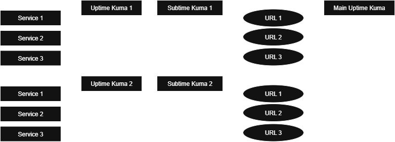
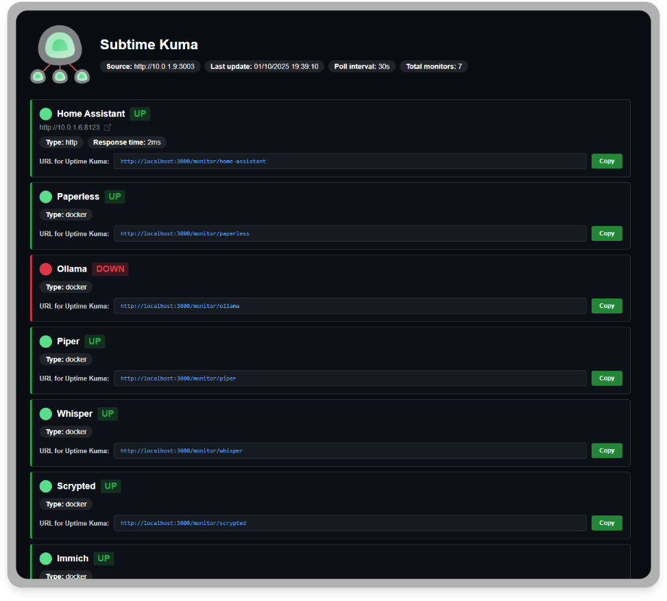

<div align="center" width="100%">
    
</div>

# Subtime Kuma

A bridge service that retrieves monitor statuses from a remote Uptime Kuma instance and exposes them via a web interface and individual health check endpoints for integration with a main Uptime Kuma instance.

## Why Subtime Kuma?

**Problem:** You have an Uptime Kuma instance monitoring your local infrastructure (Docker containers, services, etc.), but your main Uptime Kuma instance can't reach these local services directly.

**Solution:** Subtime Kuma acts as a bridge by:
1. Connecting to your local Uptime Kuma instance
2. Retrieving all monitor statuses via the API
3. Creating individual HTTP endpoints for each monitor (even for non-HTTP services like Docker containers, ports, etc.)
4. Allowing your main Uptime Kuma to monitor these endpoints

**Result:** A unified dashboard on your main Uptime Kuma instance with all monitors (local + remote), centralized notifications, and complete visibility of your entire infrastructure.



## Features

- 🔄 **Real-time monitoring**: Polls remote Uptime Kuma instance every 30 seconds
- 🌐 **Web dashboard**: Clean interface displaying all monitors with their current status
- 🔗 **Health check endpoints**: Individual endpoints for each monitor (HTTP 200/ok if UP or 503/ko if DOWN)

## Installation

### Prerequisites

- Docker (for Docker installation)
- Node.js 14+ (for manual installation)
- Access to an Uptime Kuma instance with API key

### Option 1: Docker (Recommended)

1. Create a `config.yml` file:
```yaml
source: http://ip:port
apiKey: your_api_key_here
pollInterval: 30
port: 3000
host: http://your-public-domain.com:3000
```

2. Run the container:
```bash
docker run -d \
  --restart=always \
  -p 3000:3000 \
  -v ./config.yml:/app/config.yml:ro \
  --name subtime-kuma \
  ghcr.io/bsdev90/subtime-kuma:latest
```

3. View logs:
```bash
docker logs -f subtime-kuma
```

### Option 2: Manual Setup

1. Clone the repository:
```bash
git clone https://github.com/bsdev90/subtime-kuma.git
cd subtime-kuma
```

2. Install dependencies:
```bash
npm install
```

3. Create configuration file:
```bash
cp config.yml.example config.yml
```

4. Edit `config.yml` with your settings:
```yaml
source: http://ip:port
apiKey: your_api_key_here
pollInterval: 30
port: 3000
host: http://your-public-domain.com:3000
```

5. Start the service:
```bash
npm start
```

### Configuration

| Key | Description | Example |
|-----|-------------|---------|
| `source` | Remote Uptime Kuma instance URL | `https://uptime.example.com` |
| `apiKey` | API key from remote Uptime Kuma | `xxxxx` |
| `pollInterval` | Polling interval in seconds | `30` |
| `port` | Local web server port | `3000` |
| `host` | Public URL for health check endpoints | `http://monitor.example.com:3000` |

### Obtaining an API Key

1. Log in to your Uptime Kuma instance
2. Go to **Settings** → **API Keys**
3. Click **Add API Key**
4. Set a name and optional expiration
5. Copy the generated key

## Usage

### Access the dashboard

Open your browser to `http://localhost:3000`

The dashboard displays:
- Source Uptime Kuma instance
- Last update timestamp
- Poll interval
- Total number of monitors
- Status of each monitor with details



### Health check endpoints

Each monitor gets an individual endpoint:

```
http://localhost:3000/monitor/{monitor-slug}
```

**Responses:**
- `200 OK` + "ok" - Monitor is UP
- `503 Service Unavailable` + "ko" - Monitor is DOWN
- `404 Not Found` + "ko" - Monitor doesn't exist

**Integration with main Uptime Kuma:**

1. Copy the health check URL from the dashboard (click "Copy" button)
2. In your main Uptime Kuma instance, create a new HTTP monitor
3. Paste the health check URL
4. The main instance will now monitor the remote instance's monitor status

## Troubleshooting

### "Invalid API key" error

- Verify your API key is correct in `config.yml`
- Ensure the API key hasn't expired
- Check that the remote Uptime Kuma instance is accessible

### No monitors showing

- Check that the remote instance has active monitors (paused monitors won't appear)
- Verify the `/metrics` endpoint is accessible on the remote instance
- Check console logs for connection errors

### Health check endpoints return 404

- Monitor names are converted to slugs (lowercase, alphanumeric with hyphens)
- Check the exact URL shown in the dashboard
- Verify the monitor exists in the remote instance

## License

MIT

## Contributing

Contributions are welcome! Please feel free to submit a Pull Request.
